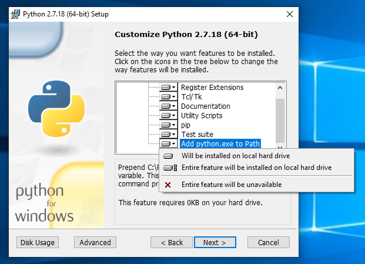
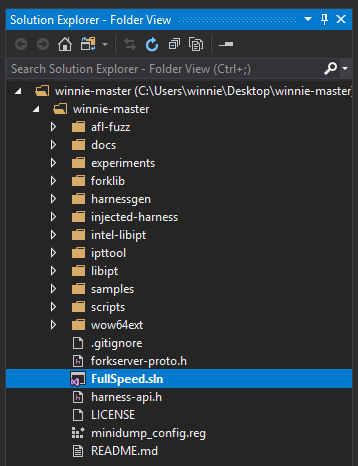

# Complete Walkthrough: Fuzzing Toy Example
This is a complete guide to setting up Winnie, installing required dependencies, and fuzzing the toy example found in `samples/toy_example`. 

## Requirements:
* Visual Studio 2017/2019
* Ida Pro (64-bit) or Ghidra 
* Winnie Code (unzipped to target directory)
* Python 2.7.XX 
* Windows 10 1809/21H2 (1809 preferred)
* Virtual machine or enviroment with *at least* 4 cores per processor
#### NOTE: Winnie only *offically* supports Windows 10 1809, Python 2.7.XX, and Visual Studio 2017. All other configurations are considered unsupported. 

### Step 0: VM Setup: Configure for 4 Cores Per Processer
Winnie requires you to be able to fork different processes, and as such will throw an error if your VM does not have the proper configurations. Make sure you set *at least* 4 cores per processor. The minimum setting are pictured below for VMWare: 

#### NOTE: If you VM is not properly configured, then you will run into the error pictured below. Make sure to reconfigure your VM based on the settings pictured above. 

### Step 1: Install Python 2.7.XX 
Python 2 must be installed *before* installing Winnie and IDA/Ghidra as you may run into pathing issues otherwise. Make sure when installing Python you select to install it to the path OR maunally add it to the path env variable. 
#### NOTE: The default option is to NOT ADD IT TO THE PATH, so make sure to change this. 

### Step 2: Install Ida Pro/Ghidra 
Install Ida Pro/Ghidra for your desired 32/64bit operating system. Please note that Ida Pro requires you install a seperate version for Python 2 and Python 3. Make sure you select the version for Python 2.7. 

### Step 3: Install Visual Studio & Required SDK Dependencies
Visual Studio 2017 is required to build the Winnie and toy example executables. Their are few key SDK's that need to be installed in order to build Winnie and the toy example correctly. 

#### For x64 systems, you need:
    * Windows 8.1 SDK

### Step 4: Build Winnie: 
First, open the containing folder using File >> open folder. You should have the entire repository

First, you need to build the Winnie executable. Select the FullSpeed.sln, and set the startup item to be the proper configuration. For our example, we used FullSpeed.sln >> Release|x64:

### Step 5: Build Toy Example:

In this guide, I'll explain how to use Winnie to fuzz a toy example program. The code for this guide can be found in `samples/toy_example`. You can build it with Visual Studio. There are 3 projects in the solution:

 - toy_example: this builds the main .exe we will fuzz
 - example_library: this is a .dll containing some buggy functionality that we want to target with our fuzzer
 - harness: this provides a bare-bones example harness to use with Winnie.

To set up the fuzzer, copy the target application (toy_example.exe and example_library.dll) to the Winnie directory (so it's next to afl-fuzz.exe). AFL needs seed inputs, so copy the seed input file (in\input). Lastly, Winnie needs a fuzzing harness to call the target, so copy our fuzzing harness `harness.dll` next to afl-fuzz.exe as well.

At this point, your directory structure should look like this:

Winnie collects coverage using *full-speed* instrumentation. Full-speed instrumentation essentially puts a breakpoint on each basic block. Thus, Winnie needs a list of the addresses of basic blocks we want to cover per module. This list is called the *bb-file* and it's specified with the `-bbfile` parameter. We can automatically generate this file with the IDAPython script `scripts/ida_basic_blocks.py` if you have IDA Pro. (There is also a script for Ghidra.) For more about the bbfile file format, check the README.

At this point, you should also have `basicblocks.bb` in the directory too. Now we can start fuzzing.

`afl-fuzz -i in -o out -t 1000 -I 1000 -- -bbfile basicblocks.bb -- -harness harness.dll -no_minidumps -- toy_example.exe @@`

**Breakdown of the command-line:**

1. `afl-fuzz -i in -o out -t 1000 -I 1000` Standard AFL parameters `-i` and `-o` for input/output dirs, execution timeout (`-t`) of 1000ms, initialization timeout (`-I`) of 1000ms.

2. `--` End of AFL options and start of fullspeed instrumentation options

3. `-bbfile basicblocks.bb` (Required) Use the basic blocks specified in the bbfile `basicblocks.bb`.

4. `--` End of the fullspeed options and start of the forkserver options

5. `-harness harness.dll` (Required) Use our fuzzing harness specific to toy_example.

6. `-no_minidumps` Disable minidumps for speed since toy_example tends to crash a lot during fuzzing. See README for more info.

7. `--` End of forkserver options and start of target argv

8. `toy_example.exe @@` Call toy_example.exe and pass the input filename as argv[1].

### Troubleshooting 

If you encounter errors, check out the README for more info on debugging or make an issue.
